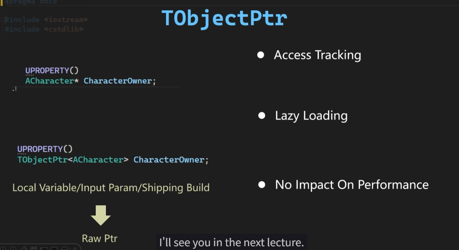
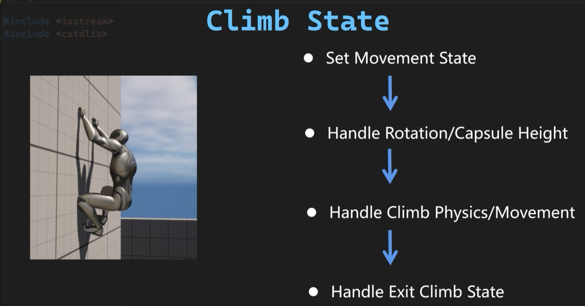
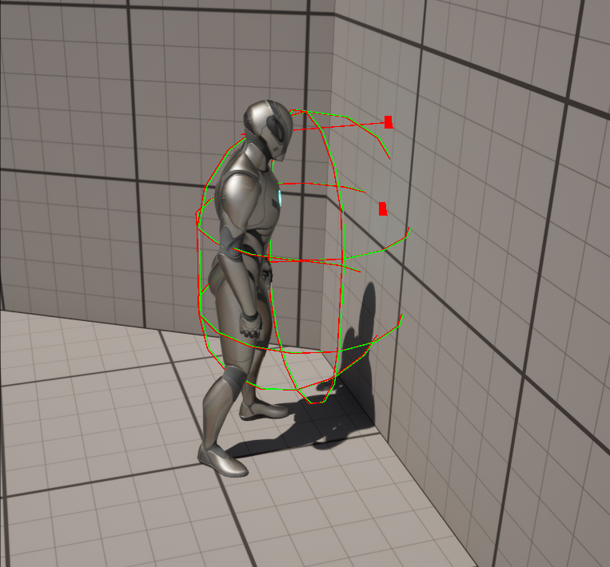
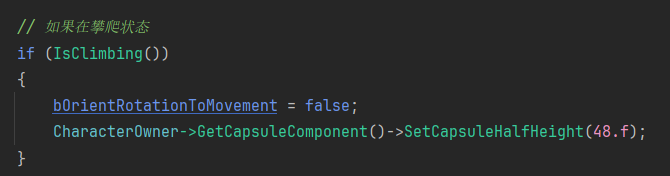
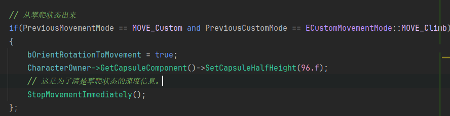
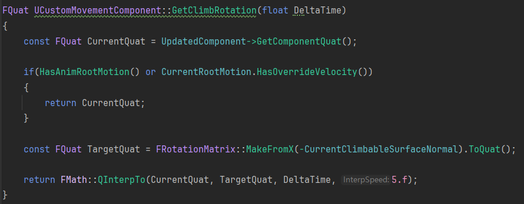
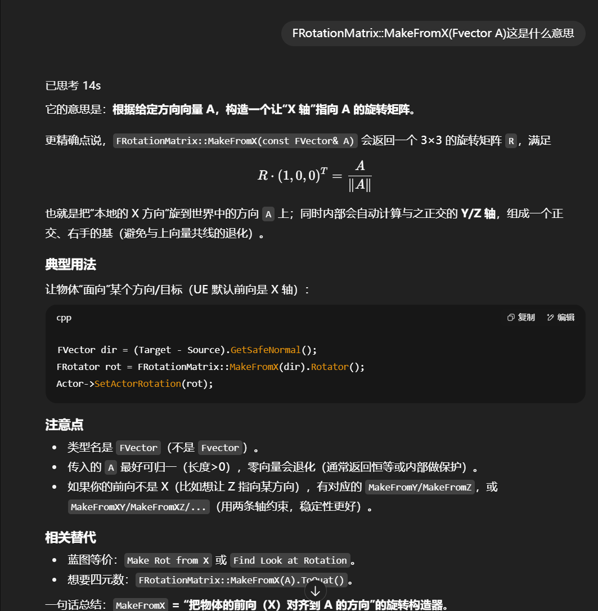

# 知识点杂项

### TObjectPtr

- 有如下特点
- 

### UE5是左手定则

### 爬墙的贴墙处理

- 实际上并没有什么方便操作
- 就是先让角色每一帧都贴住墙
- 同时让通过叉乘，将本来往前后走改为上下走。

# 关键步骤

### 首先是攀爬状态的处理

- 步骤大致如下
- 
- 胶囊体检测：为了检测是否可以攀爬。
- 眼部射线检测 ：为了检测是否到达边缘
- 
- 可以攀爬的条件：not (胶囊体碰到 and 眼部射线碰到 and 没有在下落)
- 接下来设置进入攀爬状态之后的一系列设置
- 首先设置进入攀爬状态
  - 
- 出攀爬状态的操作
  - 
- 接下来设置攀爬状态的物理状态和移动
  - 首先是物理状态：要处理可攀爬的表面、攀爬速度、攀爬旋转、把移动Snap到表面上否则角色会滑落
- 计算让角色能始终面向墙体的法线的反方向的旋转：
  - UE5中默认物体的前向是X轴
  - 做法：如果现在是根运动支配那么不改变旋转；如果不是就创建一个让由X轴转向墙的法向量的反方向的旋转。
  - 
  - 原理：
  - 
- 其次是，把角色的移动始终贴到墙上，即每次都计算沿墙面法线的“纠正位移”，让角色不管往哪移动都加上一个向量，都把角色拉回到墙上。
- 然后，判断停止攀爬的条件：计算墙面法向量与世界向上向量的夹角，当小于一定角度的时候就停止攀爬。
