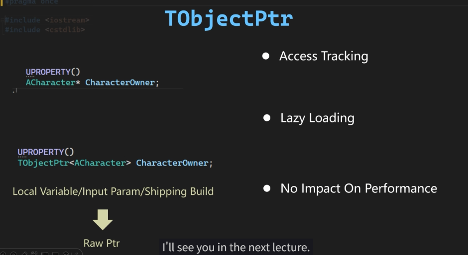
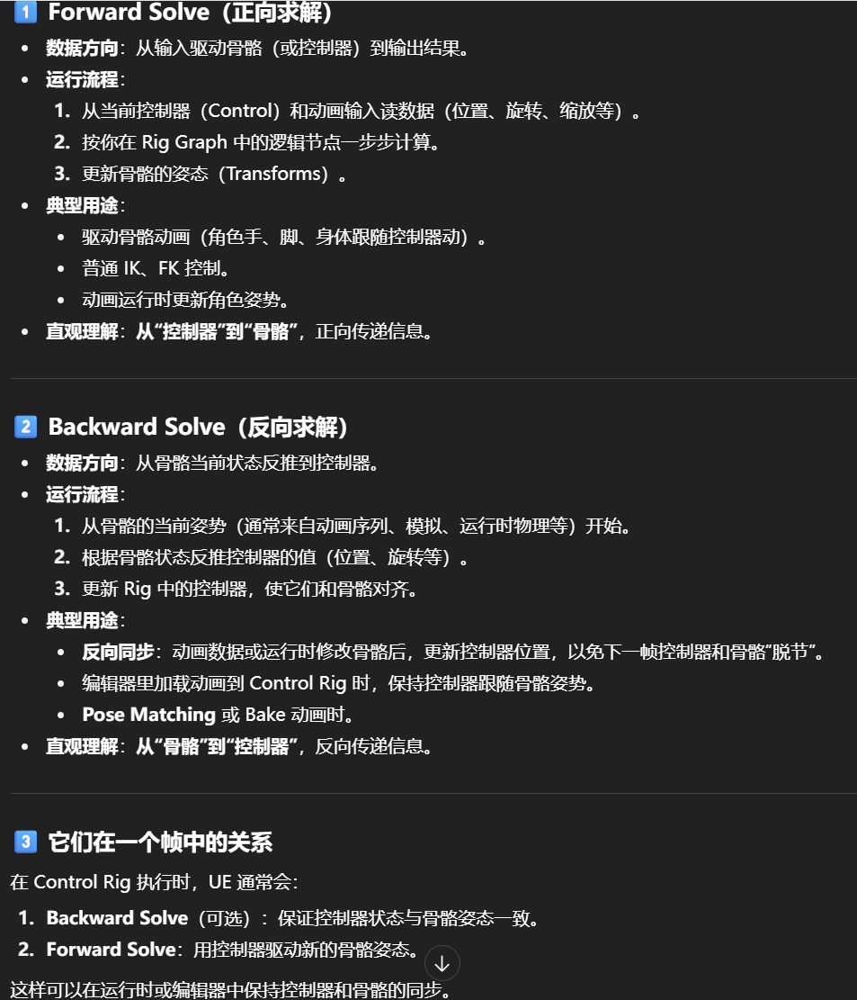
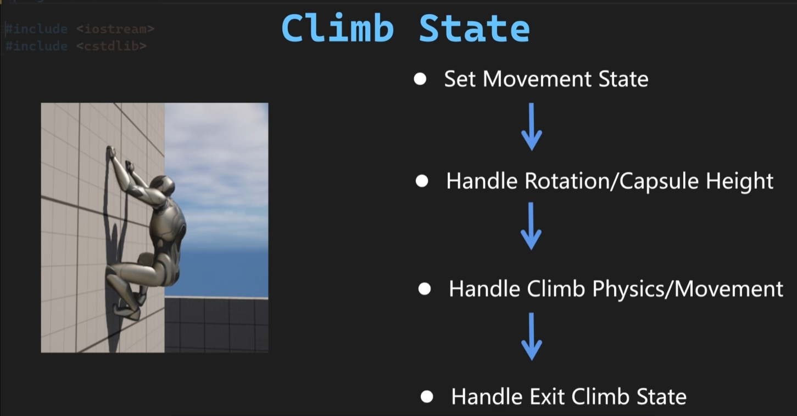
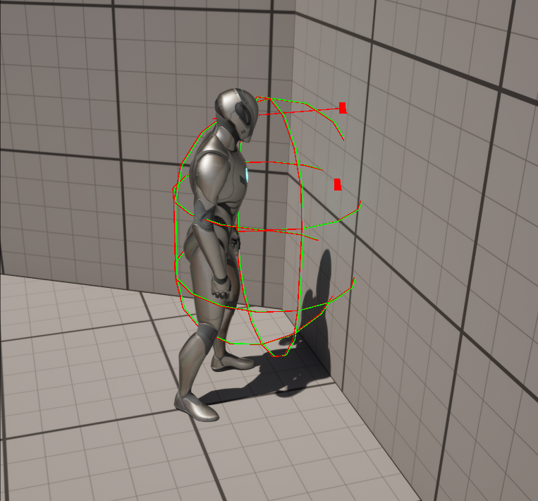
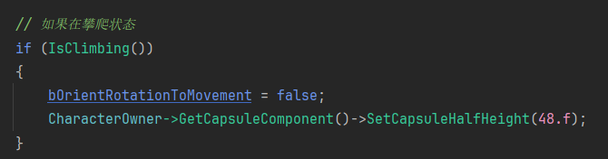
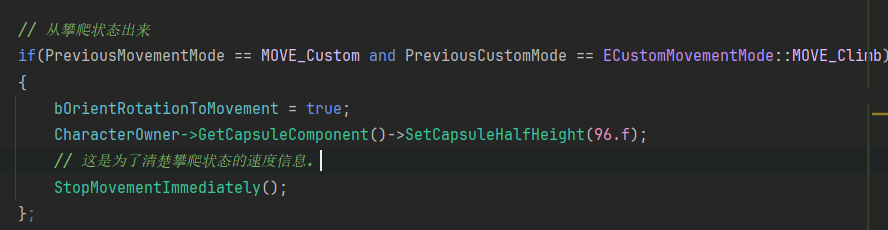
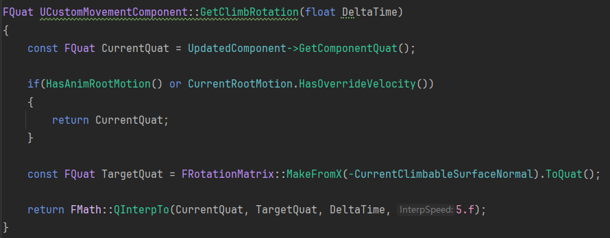
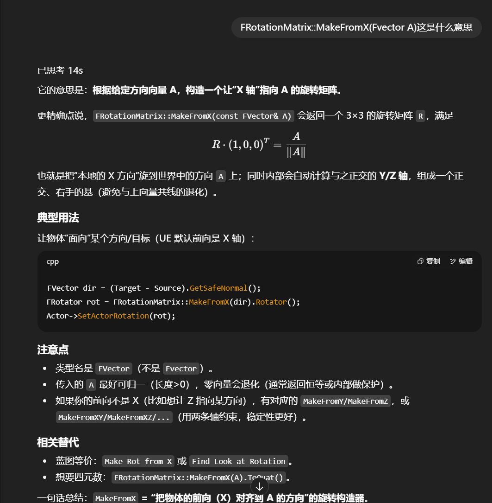
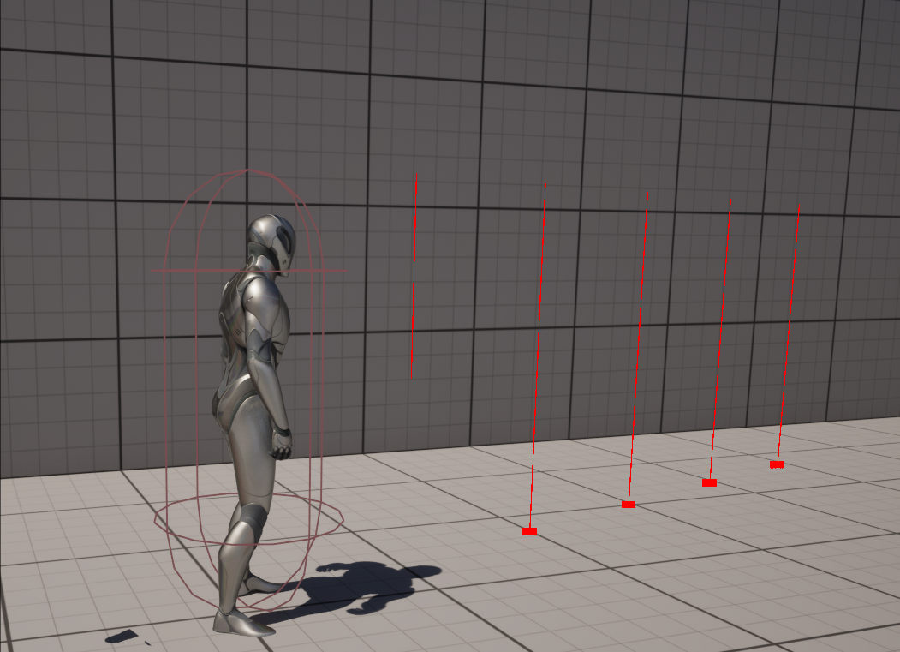

# 知识点杂项

### TObjectPtr

- 有如下特点
- 

### UE5是左手定则

### 爬墙的贴墙处理

- 实际上并没有什么方便操作
- 就是先让角色每一帧都贴住墙
- 同时让通过叉乘，将本来往前后走改为上下走。

### Control Rig的 Forward Solve 和 Backward Solve

- 

# 关键步骤

### 首先是攀爬状态的处理

- 步骤大致如下
- 
- 胶囊体检测：为了检测是否可以攀爬。
- 眼部射线检测 ：为了检测是否到达边缘
- 
- 可以攀爬的条件：not (胶囊体碰到 and 眼部射线碰到 and 没有在下落)
- 接下来设置进入攀爬状态之后的一系列设置
- 首先设置进入攀爬状态
  - 
- 出攀爬状态的操作
  - 
- 接下来设置攀爬状态的物理状态和移动
  - 首先是物理状态：要处理可攀爬的表面、攀爬速度、攀爬旋转、把移动Snap到表面上否则角色会滑落
- 计算让角色能始终面向墙体的法线的反方向的旋转：
  - UE5中默认物体的前向是X轴
  - 做法：如果现在是根运动支配那么不改变旋转；如果不是就创建一个让由X轴转向墙的法向量的反方向的旋转。
  - 
  - 原理：
  - 
- 其次是，把角色的移动始终贴到墙上，即每次都计算沿墙面法线的“纠正位移”，让角色不管往哪移动都加上一个向量，都把角色拉回到墙上。
- 然后，判断停止攀爬的条件：计算墙面法向量与世界向上向量的夹角，当小于一定角度的时候就停止攀爬。
- 现在重建动画系统，目前使用的是Blendspace（权宜之计），先把系统实现了再说，再去解决八向移动的问题。
- 现在检查是否到达地面，如果到达地面就退出攀爬状态。
  - 其实现在当胶囊体碰到地面的时候，会有地面的碰撞点的normal加入进来，这个时候意外的触发了小于一定角度退出攀爬的条件，所以也会自动退出攀爬状态。
- 向上爬到一个平台之后，触发自动攀爬上平台
  - 做眼部射线，向前并向下
- 在边缘向下进入攀爬状态，此时的检测射线是身前的两条
- 然后开始做Control rig，把手脚贴到地面上
- 其次是做Vault检测，身前若干条线。如要使用MotionWarping，并添加Notify State使角色对齐到相应的位置
  - 

- 其次是做输入上下文切换，进入攀爬状态时切换攀爬上下文，进入走路状态时就进入走路上下文
  - 在这里使用委托：进入攀爬的委托，和出攀爬的委托。
  - 使用两个委托来实现输入上下文的切换

- 做HopUp 和 HopDown，需要使用chorded Action来实现。
  - 需要获取上一个输入的向量，来判断和世界上向量的夹角，从而判断是向哪边Hop

# 待优化项

- [x] 八向移动
- [x] 下落中重新攀爬
- [x] 手脚Lock
  - 上升沿和下降沿需要是脉冲形式，因为只需要执行一次把手锁住和把手解放的操作
  - 但是手部解放的时候，需要一直设置手的目标位置就是动画蓝图输入的位置，即不额外改变位置，但是Full Body IK是一直在持续的
  - 需要匹配动画速度和运动速度
  - Idle的IK位置和刚一进入爬行动画的手的设置：刚从idle出来的状态不锁，循环之后再开始
  - 弹簧插值
  - 修复蒙太奇与control rig冲突的问题
  - 射线未检测到位置时，给原位置
- [x] 攀爬方向是根据Actor方向，不是根据摄像机方向
- [x] 向上爬到边界时，应该判断这个边界是不是水平的，判断当前攀爬的平面的法线和世界上方向夹角
- [x] Vault的Motion Warping设置
- [x] IK手脚，除了要锁定位置，还要锁定旋转，使其朝向Hit点的法线反方向
- [ ] 从边缘爬下时，应该设置notify state提前进入攀爬状态，并且需要Motion Warping对齐爬下的位置
- [ ] 不同的条件下判断应该Vault还是mantle
